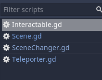

# Godot 脚本内容

1.Scene
```py
extends Sprite


func _ready():
	var tween := create_tween()
	tween.set_ease(Tween.EASE_OUT).set_trans(Tween.TRANS_SINE)
	tween.tween_property(self, 'scale', Vector2.ONE, 0.3).from(Vector2.ONE * 1.05)
	pass


```

2.Interactable
```py
extends Area2D
class_name Interactable

signal interact

func _input_event(viewport, event, shape_idx):
	if not event.is_action_pressed("interact"):
		return

	_interact()

func _interact():
	emit_signal("interact")

```

3.Teleporter
```py
extends Interactable
class_name Teleporter

export(String, FILE, "*.tscn") var target_path: String

func _interact():
	._interact()
	SceneChanger.change_scene(target_path)

```

4.SceneChanger
```py
extends CanvasLayer
onready var color_rect = $ColorRect

func change_scene(path:String):
	var tween := create_tween()
	tween.tween_callback(color_rect, "show")
	tween.tween_property(color_rect, "color:a", 1.0,0.2)
	tween.tween_callback(get_tree(), "change_scene", [path])
	tween.tween_property(color_rect, "color:a", 0.0, 0.3)
	tween.tween_callback(color_rect, "hide")

```